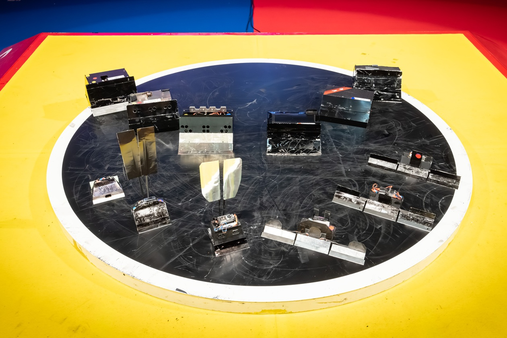
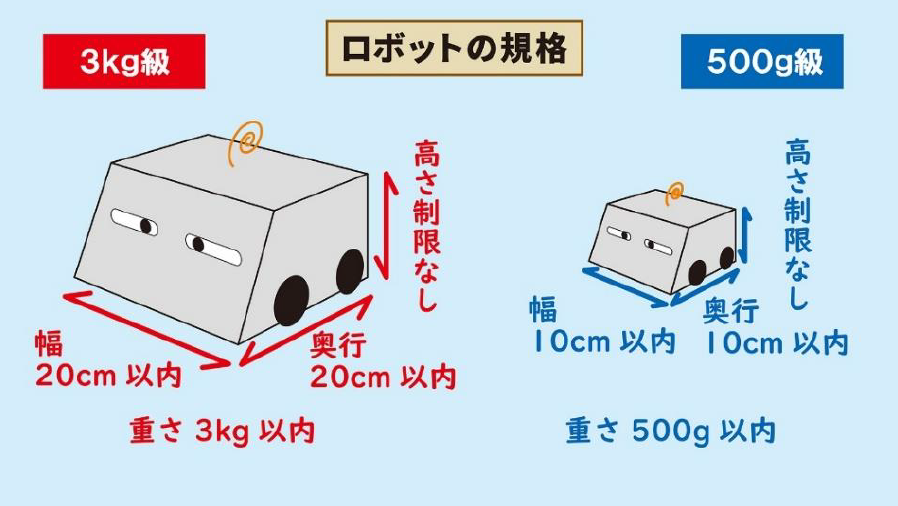
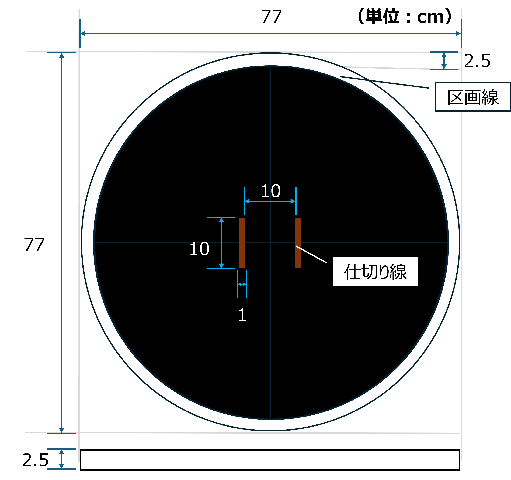
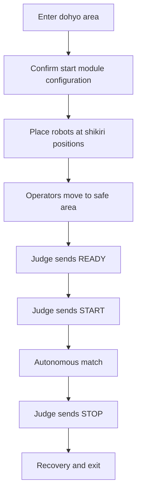
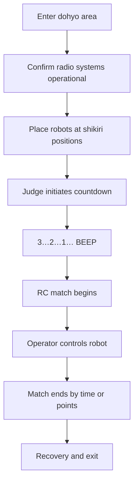
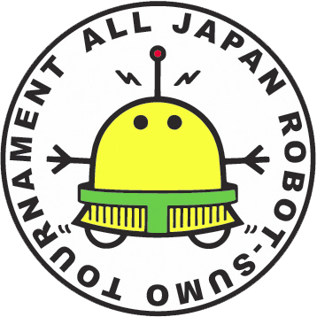

# All Japan Robot Sumo Tournament 2026 - 500g Class
## Autonomous (Auto) & Remote-Controlled (RC) Divisions
## Description
This repository documents the **competition concept, rules, and high-level design philosophy** for participating in the **All Japan Robot Sumo Tournament 2026** in the **500g class**, covering both divisions:

- **Autonomous (Auto):** fully autonomous operation after the official start signal
- **Remote-Controlled (RC):** operator-controlled robot using a legal wireless controller

At this stage, the repository focuses on **understanding the competition and defining design intent**.  
Detailed hardware and software implementations will be added in later phases.

---

## Overview

  

Robot Sumo is a head-to-head competition on a circular steel ring (_dohyo_).  
The objective is to push the opponent out of the ring or disable them within the match time.

In the **500g class**, constraints are especially strict:

- The total weight budget is extremely limited
- Size compliance at inspection is critical
- Performance depends heavily on traction, torque, stability, and control responsiveness

This project emphasizes:

- **Mechanical performance** (traction, low center of gravity, robustness)
- **Electrical reliability** (stable power delivery, clean wiring)
- **Control quality** (fast autonomous reactions, predictable RC handling)
- **Repeatable testing** and rule-compliant operation

---

## Repository Scope (Current Phase)
This README intentionally documents:

- Competition overview
- Official rule interpretation (500g class)
- High-level design concept and philosophy

Robot CAD, PCB design, firmware, and tuning details will be documented later under `/hardware` and `/software`.

---

## What the “500g Class” Represents
The 500g class is a constrained, high-performance category where success depends on balancing:

- **Weight budget** — every gram must be justified
- **Starting size compliance** — must pass the inspection gauge in the start condition
- **Traction vs. legality** — no illegal suction or artificial downforce
- **Operational reliability** — correct starts, safe behavior, and judge-compliant operation

The class rewards **engineering discipline** more than raw power.

---

## Key Rule Differences: Auto vs RC (500g)
### Autonomous (Auto)
- No operator input during the match
- Robot behavior is fully determined by onboard logic
- Uses an official or compatible **start module** controlled by judges

### Remote-Controlled (RC)
- The robot is driven by a human operator
- Control must use a legal radio system
- Match start is based on an audible **countdown timer** (3…2…1… beep)

---

## 500g Class Rules (Practical Summary)
> **Source of Truth (Planned):**  
> Numerical rule constraints are centralized in `config/rules_500g.yaml` to avoid duplication.  
> Always verify final details using the official tournament rulebook.

---

## 1) Robot Size
At inspection / before the match starts, the robot must satisfy:

- **Width ≤ 10 cm**
- **Depth ≤ 10 cm**
- **Height: not restricted**

### Inspection Gauge
For the 500g class, organizers use a dedicated inspection gauge:

- Inner dimensions: **105 mm × 105 mm**
- The robot must touch **two perpendicular sides**
- The remaining two sides must have visible clearance

This rule strongly influences start-condition design.

---

## 2) Robot Weight
- Maximum total mass: **500g**
- Includes all mounted components (battery, electronics, sensors, fasteners, etc.)
- Any exclusions depend on official definitions and division rules

Weight compliance must be maintained throughout the event.

  

---

## 3) Dohyo Specifications
The standard 500g dohyo has the following characteristics:

- **Height:** 2.5 cm
- **Diameter:** 77 cm
- **Surface:** black melamine sheet on a wooden base
- **Starting lines (Shikiri-sen):** brown lines near the center
- **Boundary line:** white; the line itself is considered **inside**

### Dohyo Diagram

  

---

## 4) Match Format and Scoring
A match is typically:

- **3 minutes**
- **Best-of-three points** (first to 2 points wins)

If the match is undecided, judges may determine the result by advantage or extension, depending on tournament rules.

### Point Conditions (Typical)
A point is awarded when:

- The opponent exits the dohyo beyond the boundary, or
- The opponent loses by penalties, stoppage, or judge decision

---

## 5) Start Procedures
### Autonomous (Auto)
Auto-class robots use a **start module system** to prevent false starts:

- Judges transmit IR signals using an official remote
- Robots must support three states:
  - **Ready**
  - **Start**
  - **Stop**
- The robot must remain completely still until the **Start** signal is received

### Remote-Controlled (RC)

RC-class robots use a **countdown timer system**:

- Judge initiates an audible countdown (3…2…1… beep)
- Robots may move immediately after the final beep
- Operators control robots using legal radio systems throughout the match

---

## Development Roadmap
### Current Phase (Concept & Rules)
- [x] Document competition overview and rules
- [x] Define design philosophy and constraints
- [x] Create structured configuration files
### Next Phases
- **Hardware Design** (`/hardware` folder)
  - Mechanical CAD and chassis design
  - PCB design and component selection
  - Power system and motor selection

- **Software Development** (`/software` folder)
  - Firmware for Auto state machine
  - RC control implementation
  - Sensor integration and algorithms

- **Testing & Validation**
  - Prototype building and testing
  - Rule compliance verification
  - Performance optimization

---

### Resources
- [Official Tournament Rulebook](https://www.fsi.co.jp/sumo/rule/index.html)
- [Robot Sumo player notification](https://robot-sumo.jp/sumo/tournament/player-notification/)

  

